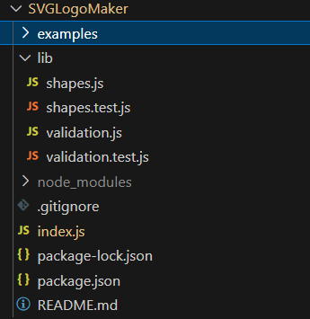
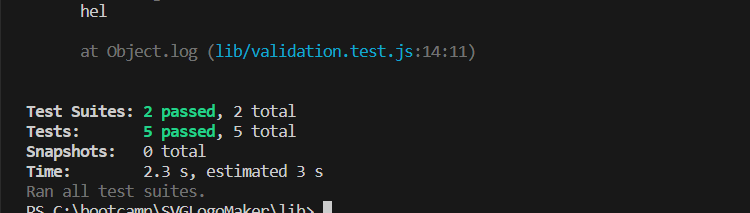
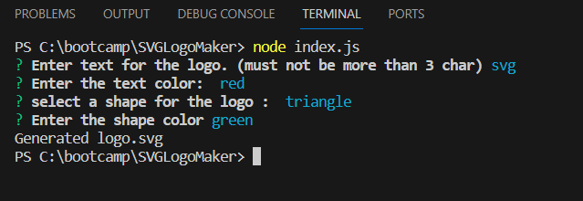
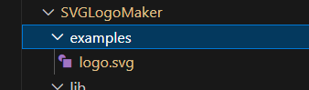
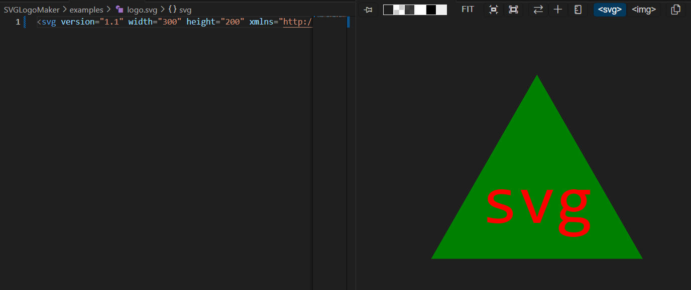
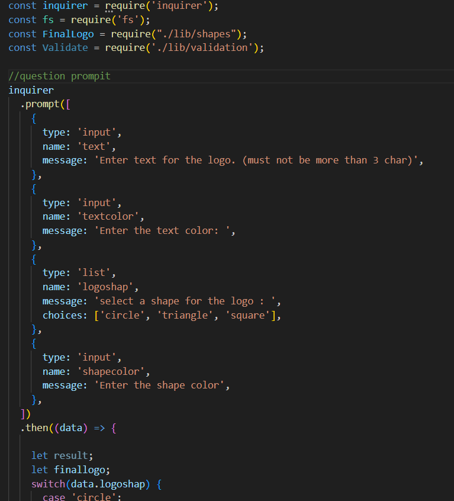
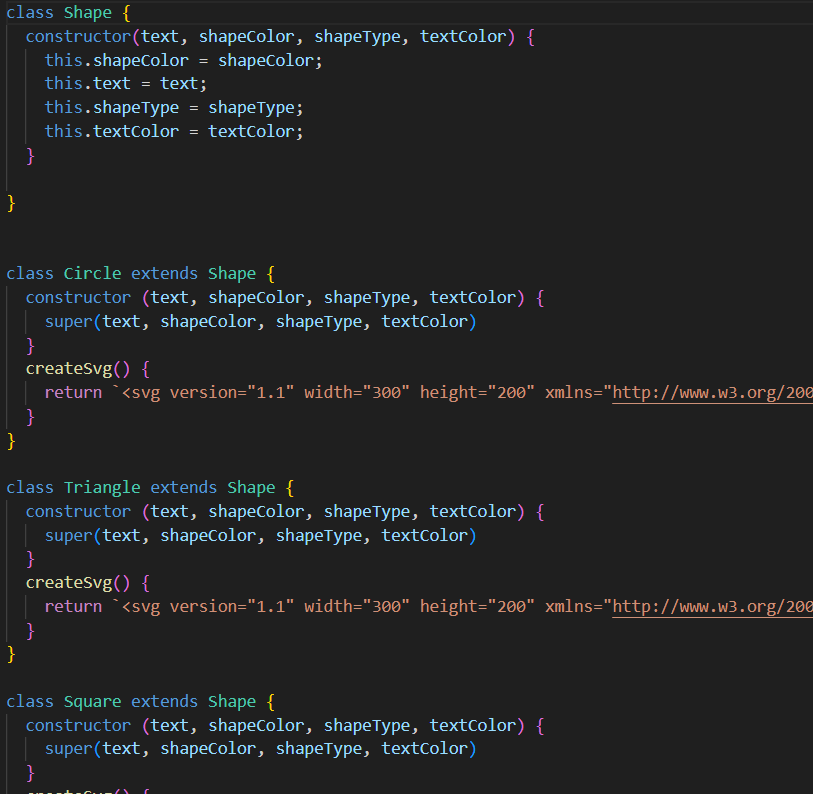
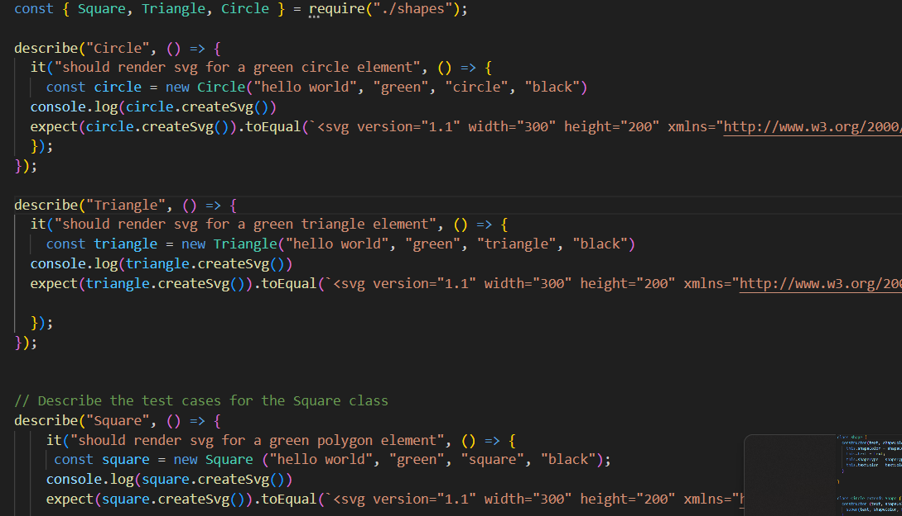

# SVGLogoMaker

## Description

I learn OOP and how to sperate the code to many files and make them more organized , I learn how to test the code before I run it inside the project,I build this project to generate logo using SVG file 

- What problem does it solve?
1- add user input using prompit for logo-text,color for logo-text,backgroung-shape(circle, triangle, and square) and the shape-color 
2- when user input logo-text more than 3 char , the project will slice the text for first 3 number
3- when user input hexadicimal color code the project will send the code to class to check if the code found
4- user can check one of the shape list 
5- when user input all the question , the project will generate a new SVG file name as logo.svg
6- about the test , I have two files one for testing the (circle, triangle, and square) classes , second one for (Textchar, Textcolor)

## Installation

the project has two installation process one for (package.json) and it's install using this command in terminal "npm init"
another process is (node_modules) and it's install using this command in terminal "npm install inquerer@8.2.4" also has "npm i -D jest " to install devDependencies to package.json file and then add Jest to test("scripts": {"test":"jest"})

## Usage
run the project from the terminal and write "node index.js", if the project doesn't show the question starting generated that mean we have to install packages as expline on installation.
after user input all the question , the projet will generate logo.svg file inside examples folder

github :  https://github.com/omeraus6/SVGLogoMaker

image 1: Question input come from generate function question and the question save on arrat

image 2: Readme-files folders

image 3: Part from README.md generate

image 4: function check if the license array if it same as the user input

image 5: generate README function

image 6: question and names array 

image 7: this function generate question prompt from question and names array.
          dataobj is an object variable collect the data value from user

image 8: Save file function

video: show the project run

## Credits

Thank you for tips and sugestion from Bootcamp instructors and classmates, I hava used https://www.w3schools.com/ , https://stackoverflow.com/ and https://developer.mozilla.org/en-US/docs/Web/CSS/grid-template to reserch information 

## License

Please refer to the LICENSE in the repo.